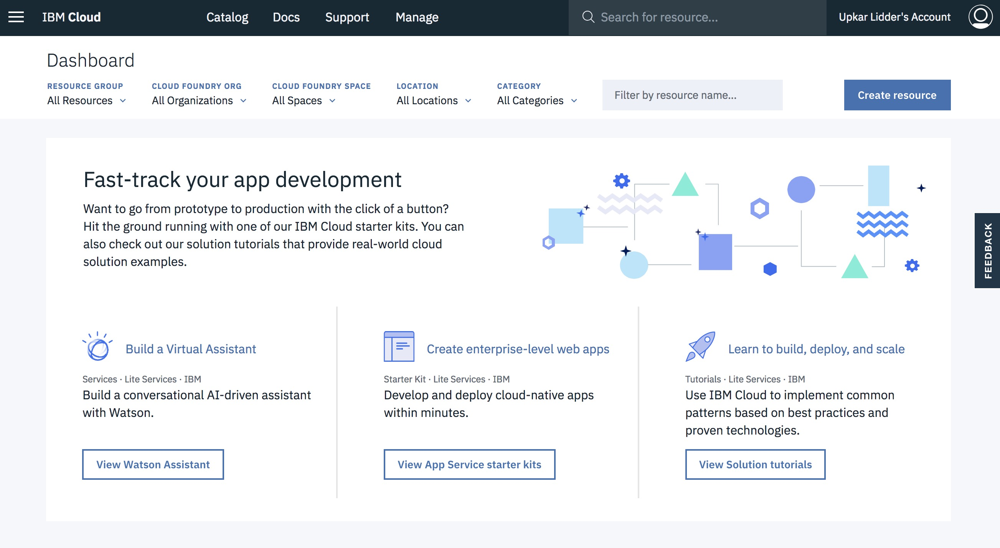
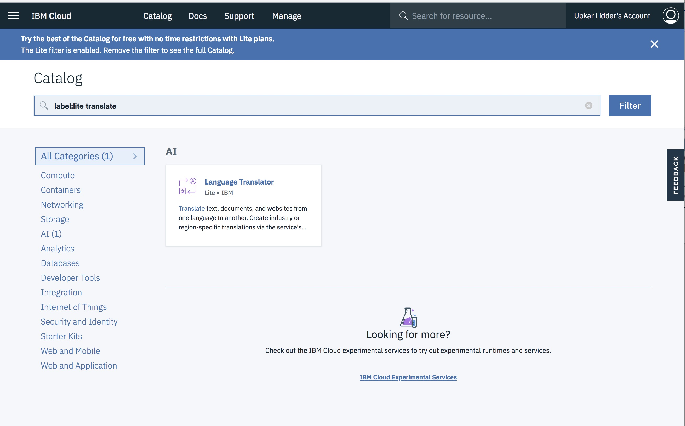
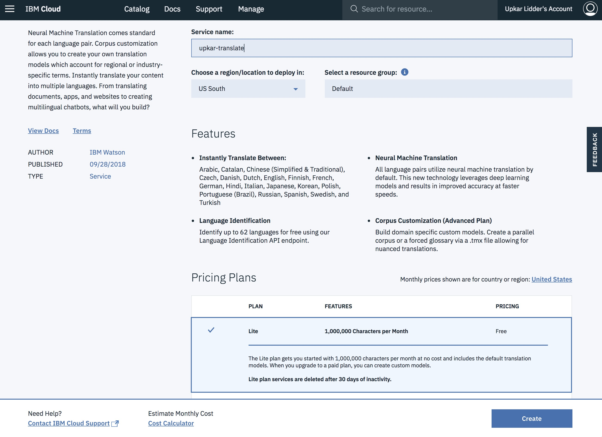
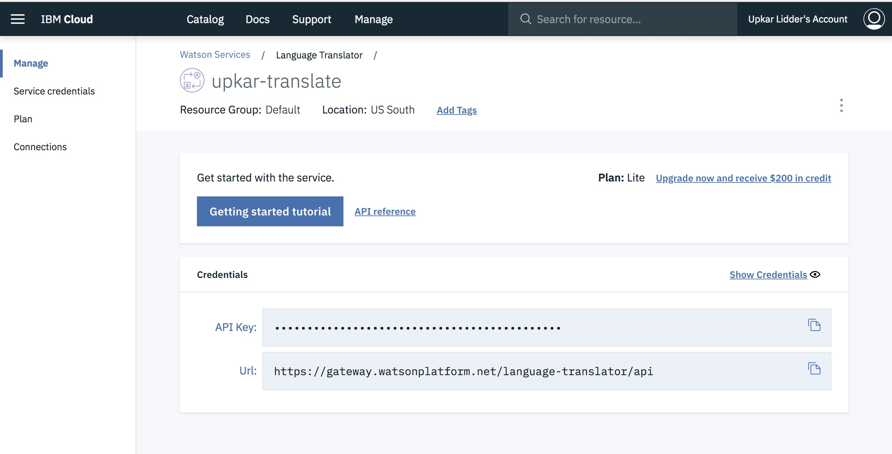
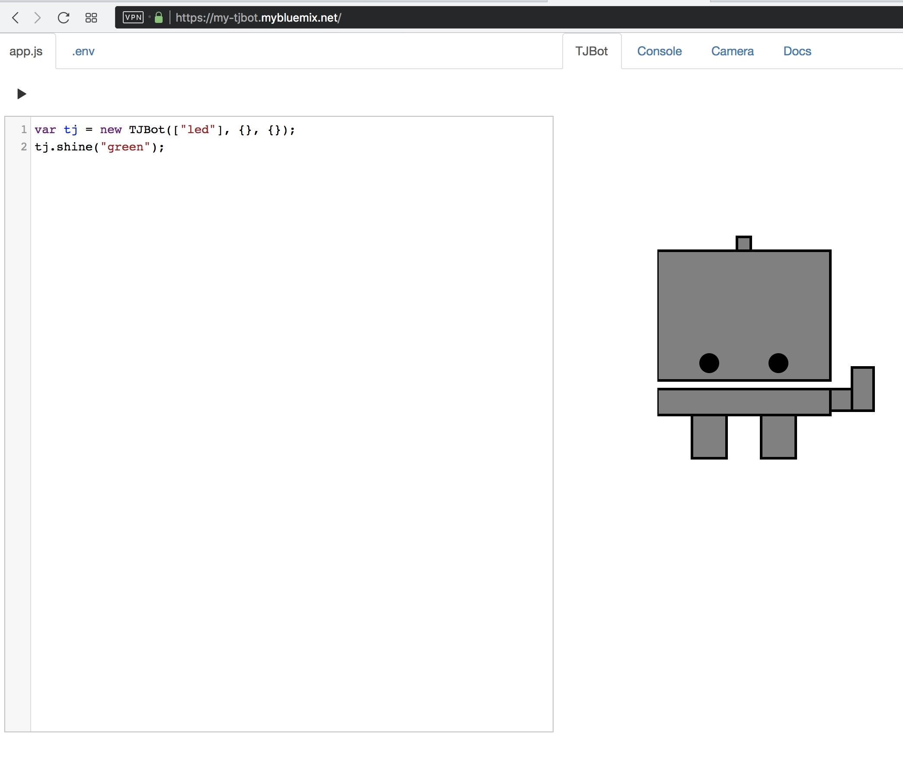
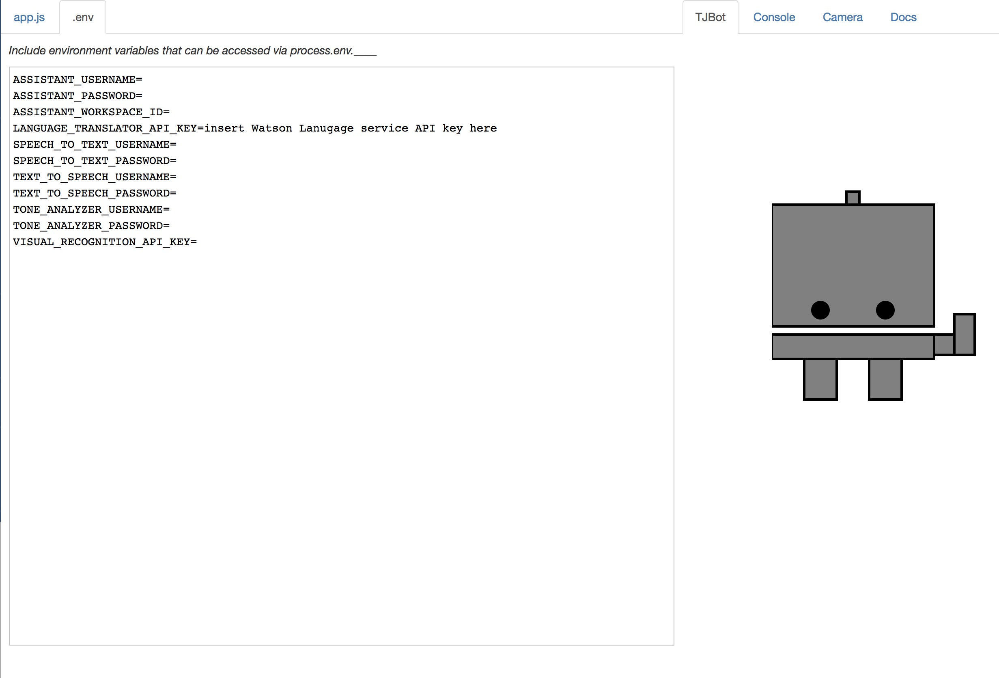
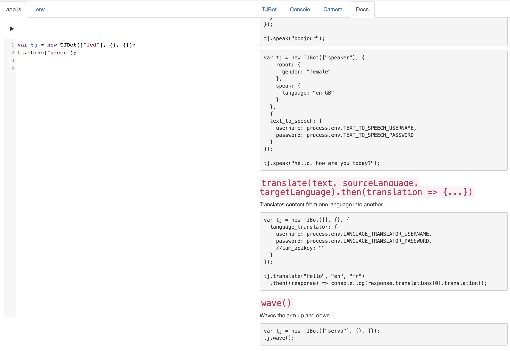
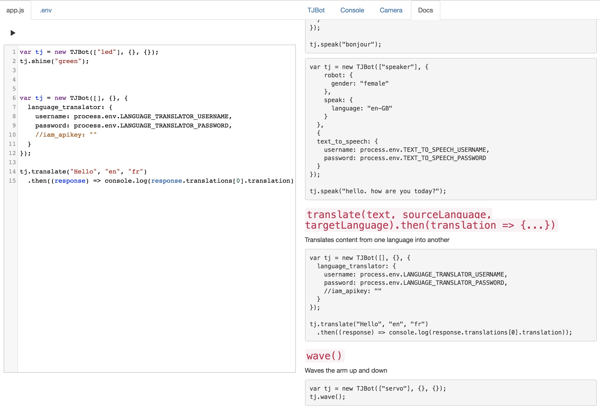
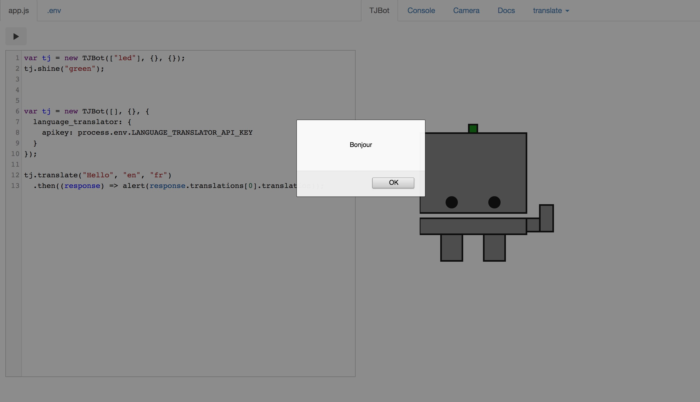
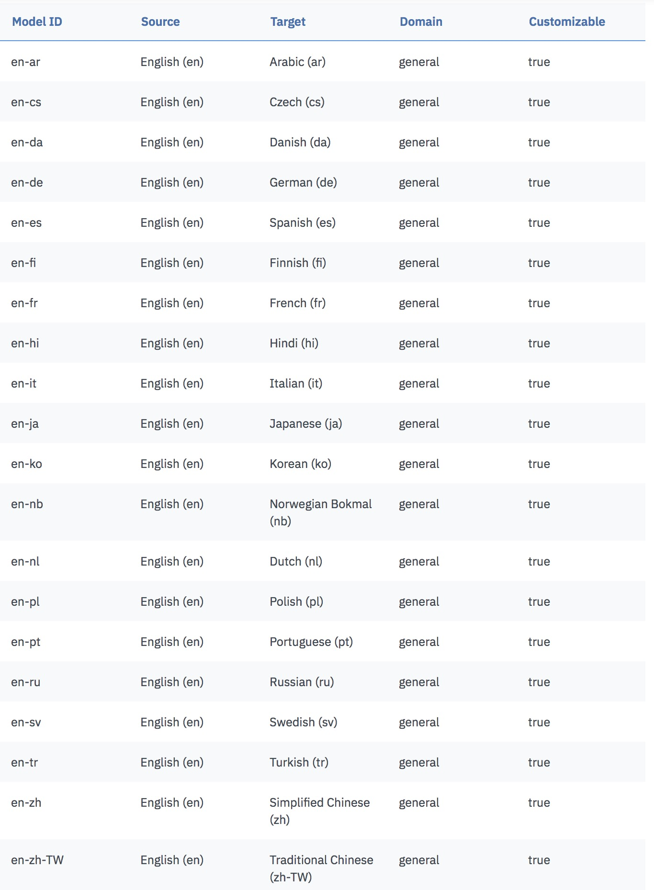

# You deployed a chatbot on Slack -- what's next?
## *An IBM/Slack joint meetup*


<!-- TOC -->

- [Welcome to the IBM booth at Silicon Valley Code Camp Raffle](#welcome-to-the-ibm-booth-at-silicon-valley-code-camp-raffle)
  - [Sign up for IBM account](#sign-up-for-ibm-account)
  - [Log In and Initialize Watson Language Translate Server](#log-in-and-initialize-watson-language-translate-server)
  - [Say hello in your favorite language using TJBot Simulator](#say-hello-in-your-favorite-language-using-tjbot-simulator)

<!-- /TOC -->

Welcome ! Follow the steps below to win the IBM raffle at SVCC 2018. You `DO NOT` need a credit card to complete this challenge. It should take you approximately `10 minutes` to complete the challenge. 


1. [Sign up for IBM Cloud.](ibm-signup.md)

## Sign up for IBM account
1. Go to [IBM Cloud Registration](https://console.bluemix.net/registration/) and enter the required information.


2. You will receive a confirmation email. Click on `Confirm Account` to finish signing up for your IBM Cloud account
3. Log into your IBM Cloud account and follow the steps below.

## Log In and Initialize Watson Language Translate Server
1. Click on `Create resource`.


2. Type in `translate` in the search bar to look for the translation service.


3. Choose the `Lite` plan and click create.


4. Make an note of your `API key`. Or you can always come back to this page for it.



## Say hello in your favorite language using TJBot Simulator

1. Go to the [TJBot Simulator](https://my-tjbot.mybluemix.net/).

  
2. Click the play button and the light on top of the bot should turn green.

3. Paste your `translator API key` in the .env tab. 


4. Click on the `Docs` tab.


5. Look for the `translate` section. Either copy paste the code or simply click on the code to copy in the editor.


6. Remove the username and password from the language_translator object. Uncomment the iam_apikey attribute and add `process.env.LANGUAGE_TRANSLATOR_API_KEY`. This is what the final code should look like:

```
  var tj = new TJBot([], {}, {
    language_translator: {
      iam_apikey: process.env.LANGUAGE_TRANSLATOR_API_KEY
    }
  });

  tj.translate("Hello", "en", "fr")
    .then((response) => console.log(response.translations[0].translation));
  ```
  
7. You can change `console.log(...)` to `alert(...)`.
  

Note: The following languages are currently supported by Watson Lanuage Translation Service: 

  

Check here for an [updated list](https://console.bluemix.net/docs/services/language-translator/translation-models.html#translation-models).

## Enter the raffle
1. Take a screenshot and tweet with `@ibmcodesf` and `@sv_code_camp` and hastags `#chatbot` and `#svcc2018`.
2. If you don't use twitter, just come by our booth and show us your final TJBot to enter the raffle.

