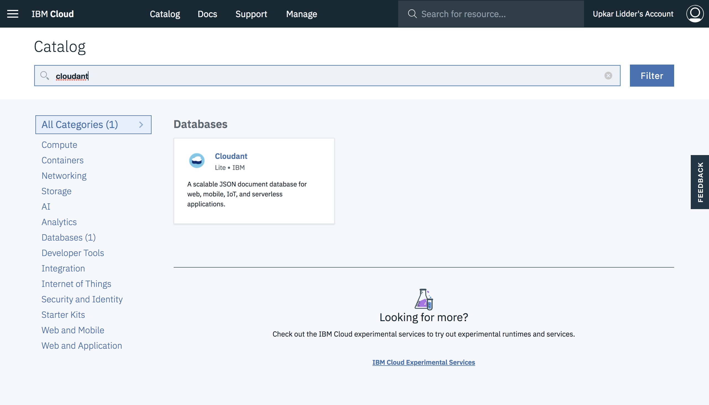
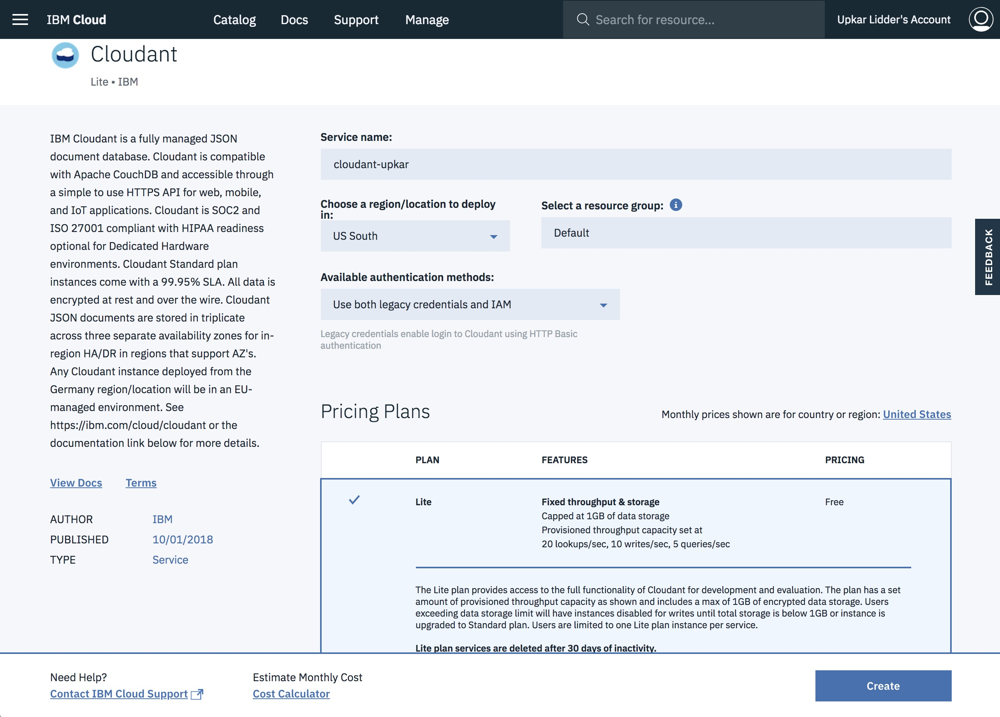
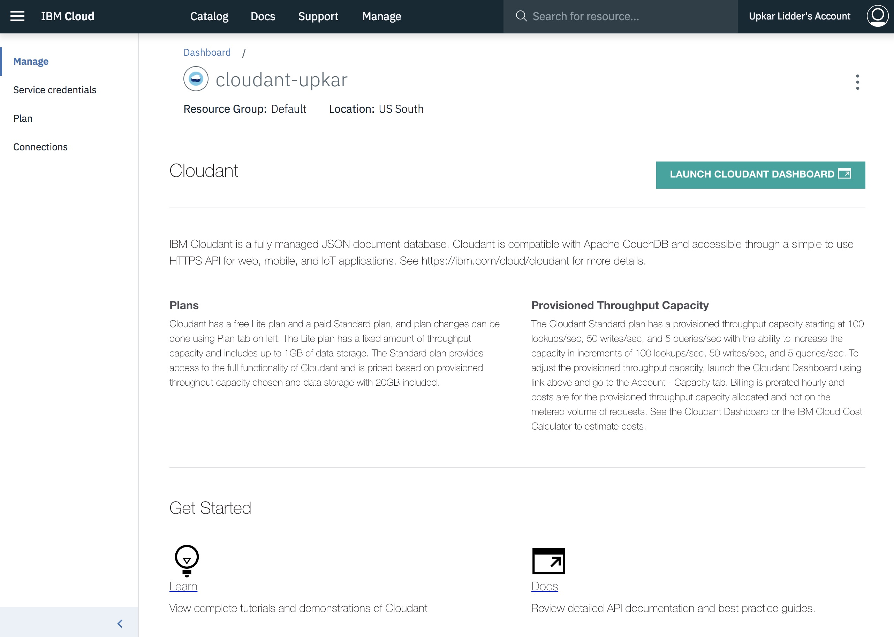
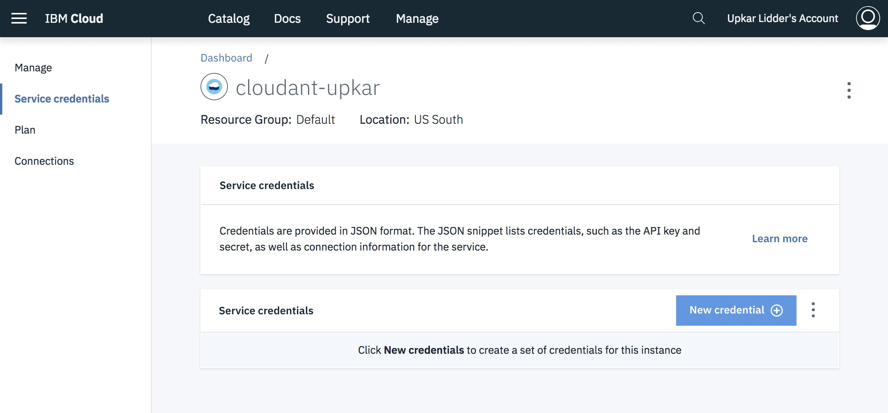
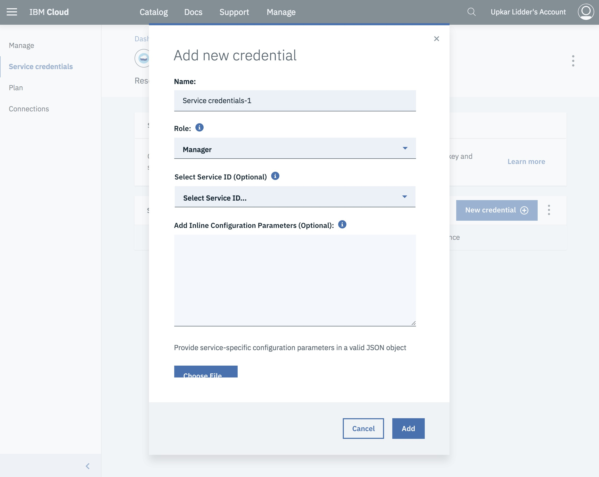
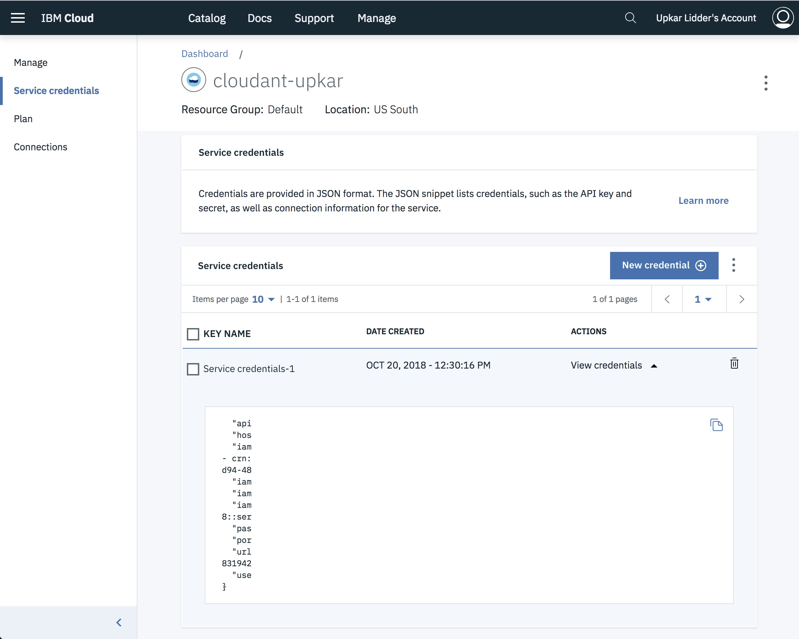
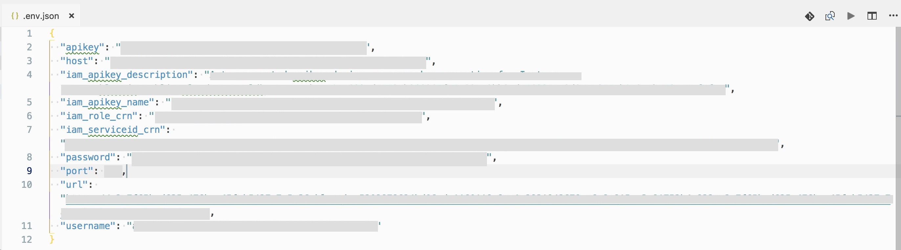
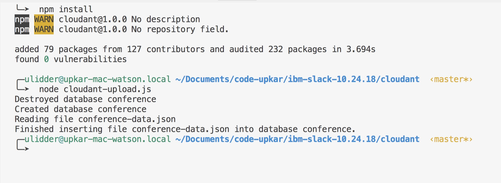
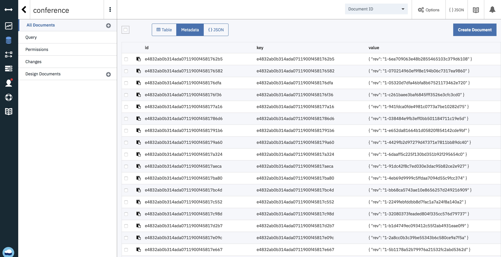

# Create and Populate Cloudant Database

## Create the Cloudant Service on IBM Cloud

1. Sign into [IBM Cloud](https://console.bluemix.net).

    

2. Click on `Catalog` and pick `Cloudant` by using the search field.
  
    

3. Pick the `Lite` plan and `Use both legacy credentials and IAM` for available authentication methods.

    

4. You should see the launch screen after you click `create`.

    

5. Click on `Service credentials`.

    

6. Create a new credential if one is not there already. You can leave the options as they are.

    

## Copy the credentials to the local .env file

7. Copy the complete json using the copy icon on the top right.

      

8. **Make a copy of `cloudant/example.env.json` and name the file `cloudant/.env.json`**. Note the dot before the name.

9. Copy the credentials into this json file.

      

## Insert json data form your laptop to the Cloudant database

10. Run the `cloudant/cloudant-upload.js` file to create the database in Cloudant on IBM Cloud. The file uses your credentials from the .evn.json file.

    `cd cloudant`

    `npm install`

    `node cloudant-upload.js`
    
(in some windows env, the above js may not work because L#8 "  account: process.env.username," in cloudant-upload.js may pick up the OS username instead of the "username" in the .env.json. When this happens, you can change username --> username1 in both cloudant-upload.js and .env.json. Then it will work fine.) 

      

  11. Go back to your cloudant launch page and `LAUNCH CLOUDANT DASHBOARD`

      

  12. You should see the `conference` database with 103 records.

      

### [Go back to main page](README.md)

