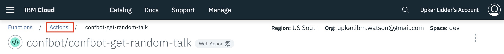
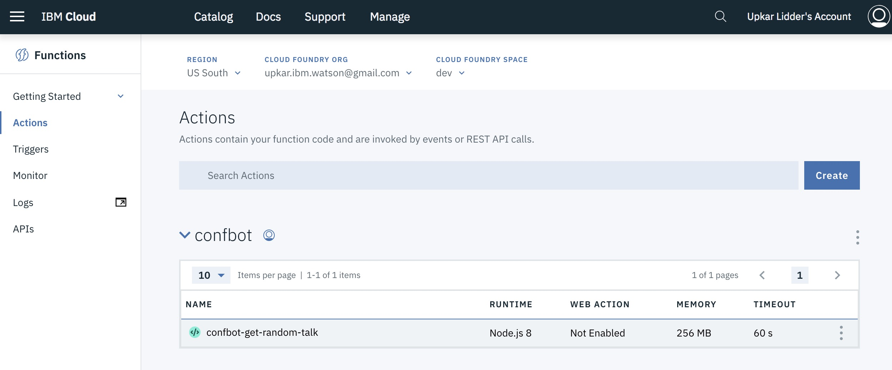
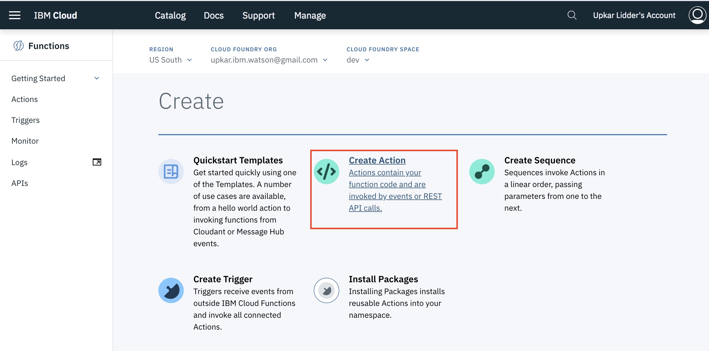
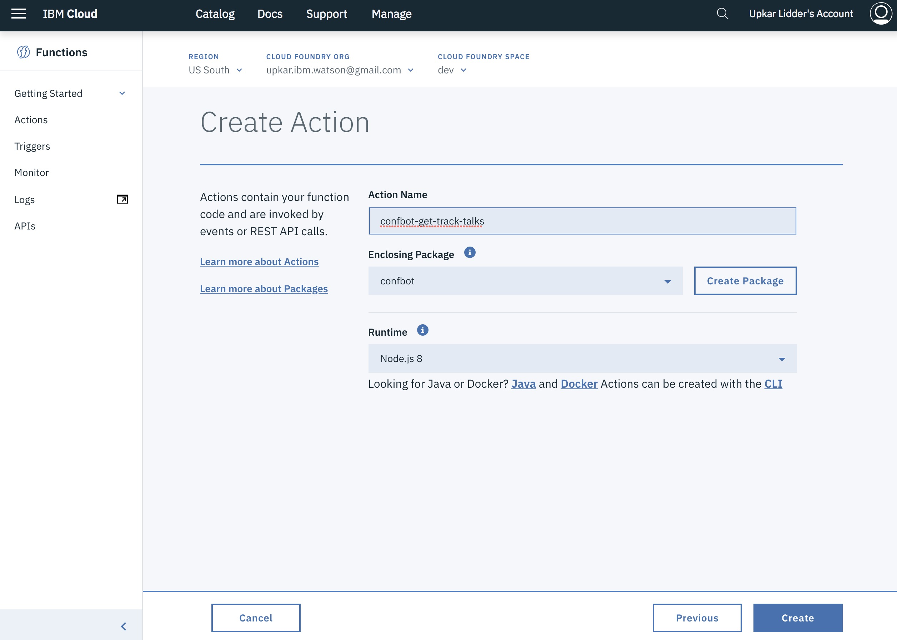
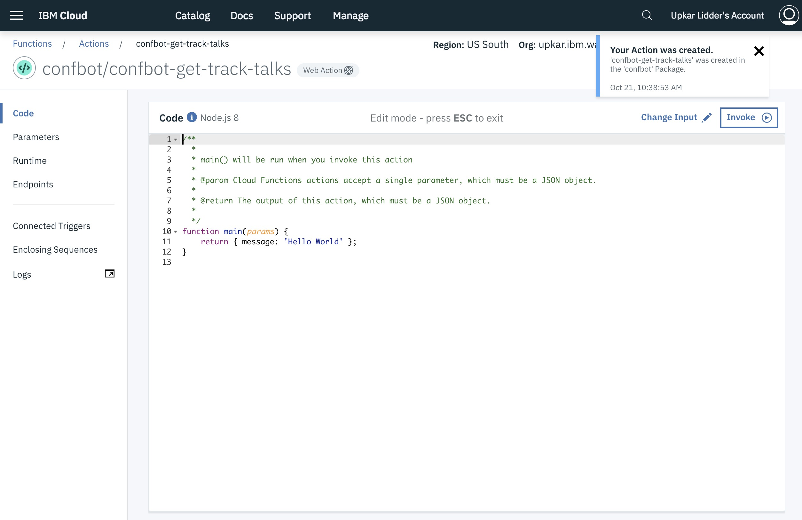
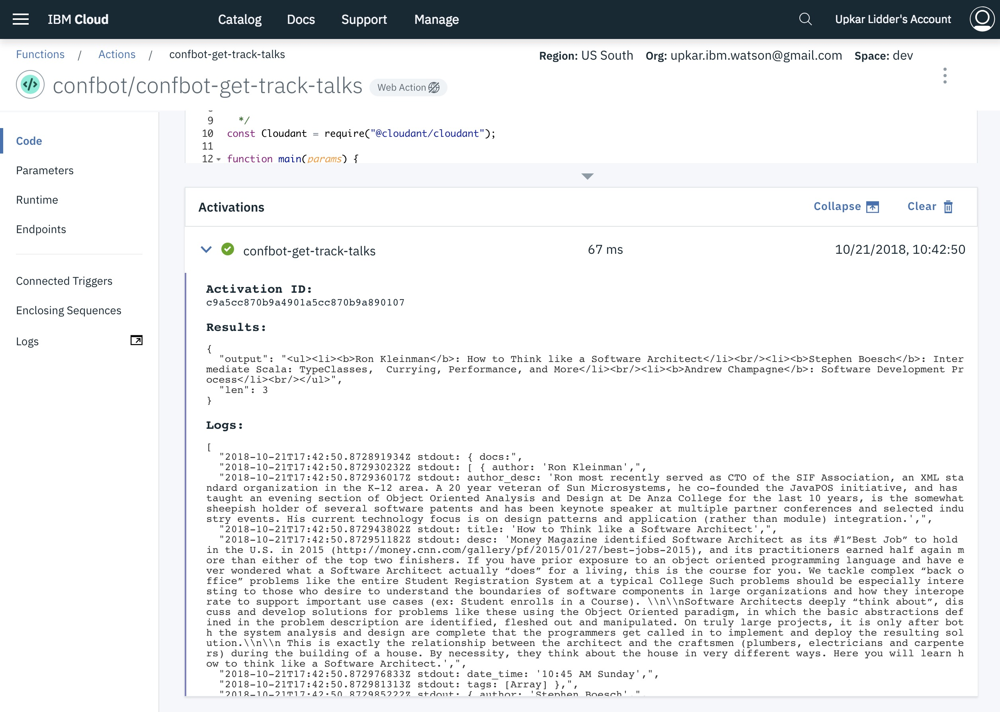
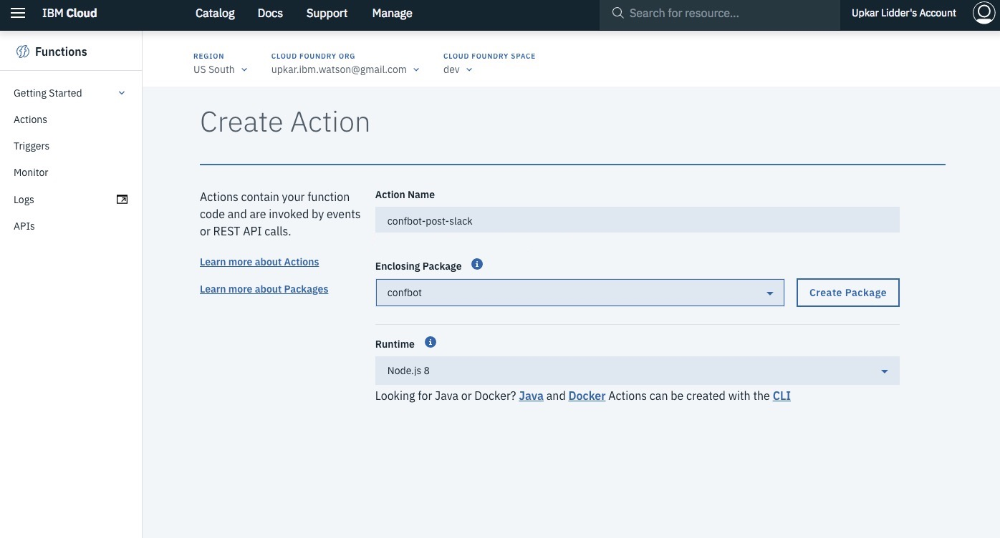
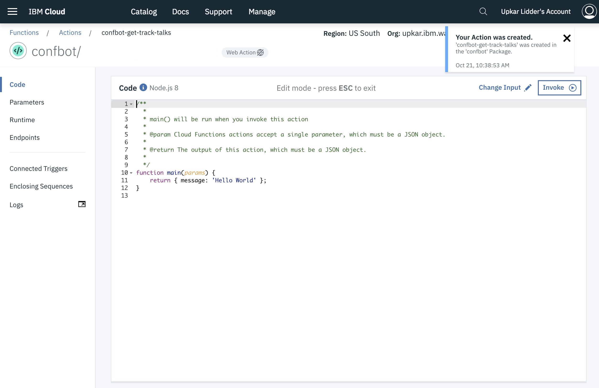
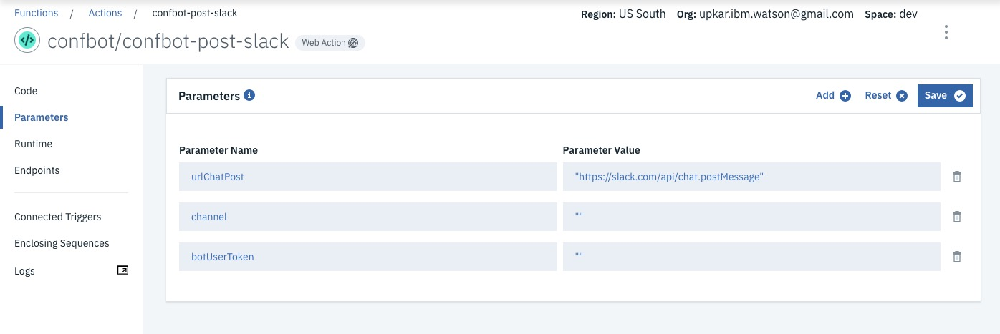
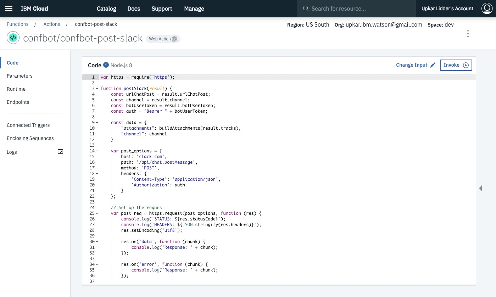

# Create and Populate Cloudant Database

## Launch IBM Function

1. Sign into [IBM Cloud](https://console.bluemix.net).

    

2. Click on `Catalog` and enter `function` in the search field. Select the `Functions` service by IBM.
  
    

3. Launch the IBM Function page by clicking on `Start Creating`.
  
    

4. If you get the error below, close the dialog and pick `US South` 

    

    ## Create an action to get three talks for a given `tag/track`

## Create an action to get a talks by track/tag

5. Click `Actions` to go to the main page.

    

    You should see the function you created in the previous step.
    
    

6. Click on `Create` to create a new action. Pick `Create Action`. 

    

7. Give your action the name `confbot-get-track-talks`. Pick `confbot` as the enclosing package.

    

8. Once you click `Create`, you will be brought into the action.

    

9. Click on params and set the following.

    

10. Click on `code` and add the contents of the file `ibm-function/confbot-get-track-talks.js` to the action.

    

11. Click on `invoke` to run the function. You should see three talks with the tags `scala` in the output.

    

## Create an action to format for Slack

12. Click `Actions` to go to the main page.

    

13. Click on `Create` to create a new action. Pick `Create Action`. 

    

14. Give your action the name `confbot-post-slack`. Pick `confbot` as the enclosing package.

    

15. Once you click `Create`, you will be brought into the action.

    

16. Click on params and set the following.

    

17. Click on `code` and add the contents of the file `ibm-function/confbot-post-slack.js` to the action.

    
### [Go back to main page](README.md)
