# Create and Populate Cloudant Database

## Launch IBM Function

1. Sign into [IBM Cloud](https://console.bluemix.net).

    

2. Click on `Catalog` and enter `function` in the search field. Select the `Functions` service by IBM.
  
    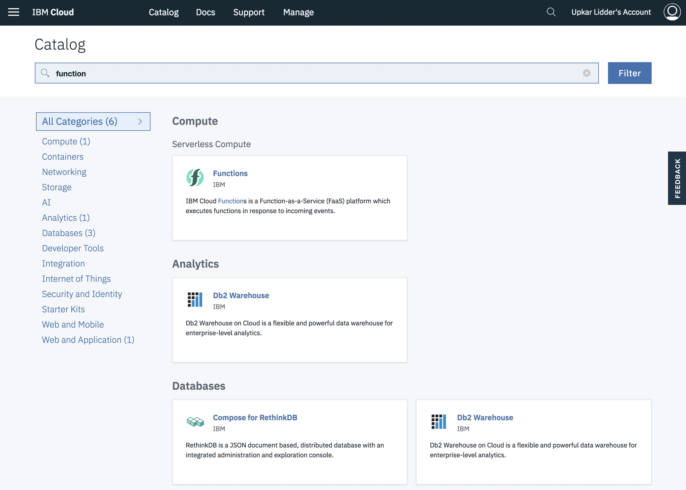

3. Launch the IBM Function page by clicking on `Start Creating`.
  
    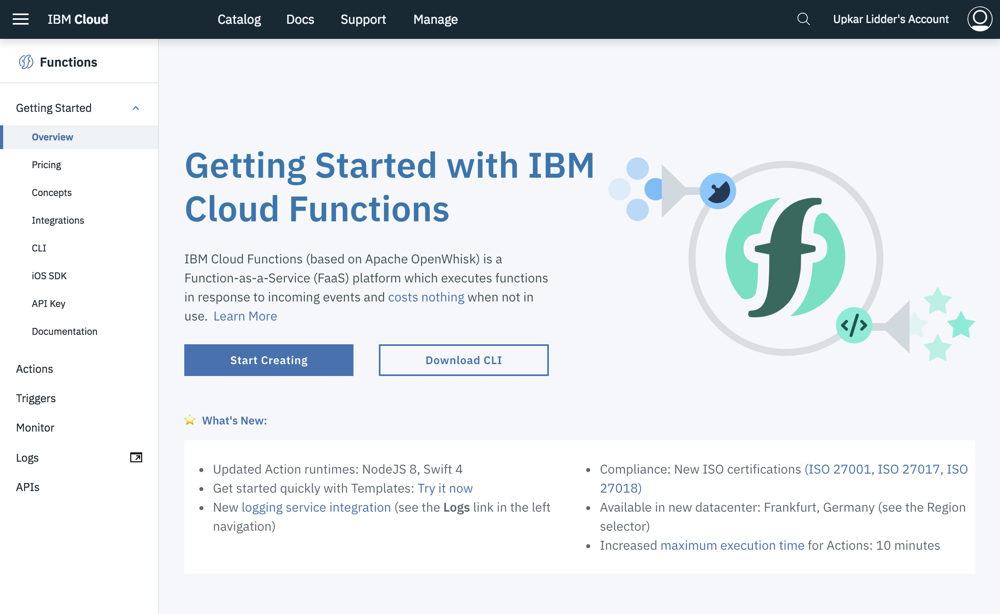

4. If you get the error below, close the dialog and pick `US South` 

    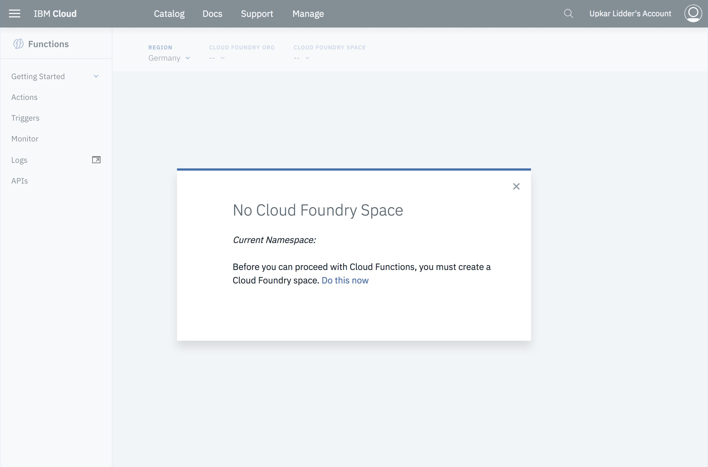

    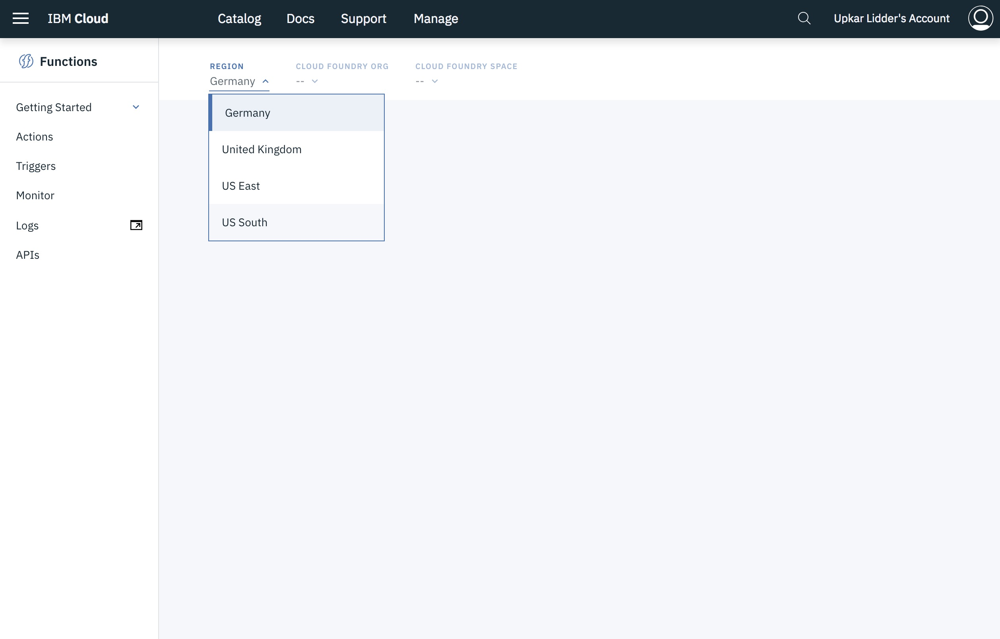
## Create an action to get a random talk

5. Click `Create` to create a new action.

    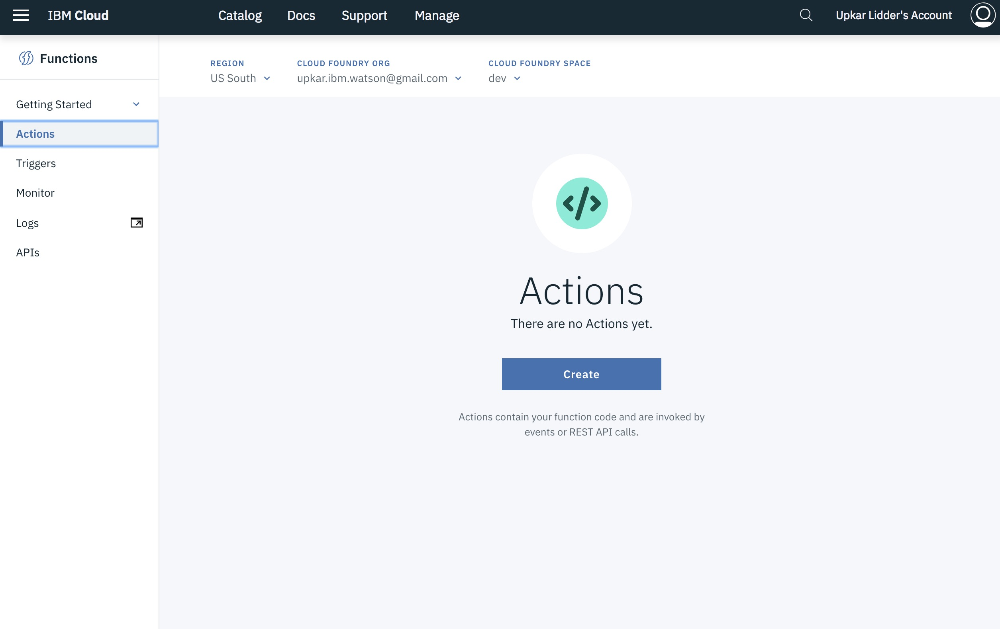

6. Give the action the name `confbot-get-random-talk`.

    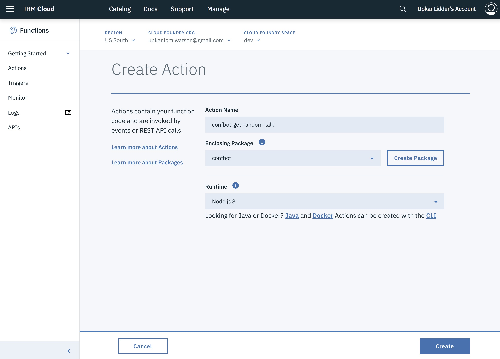

7. Create a package with the name `confbot` instead of picking the default package.

    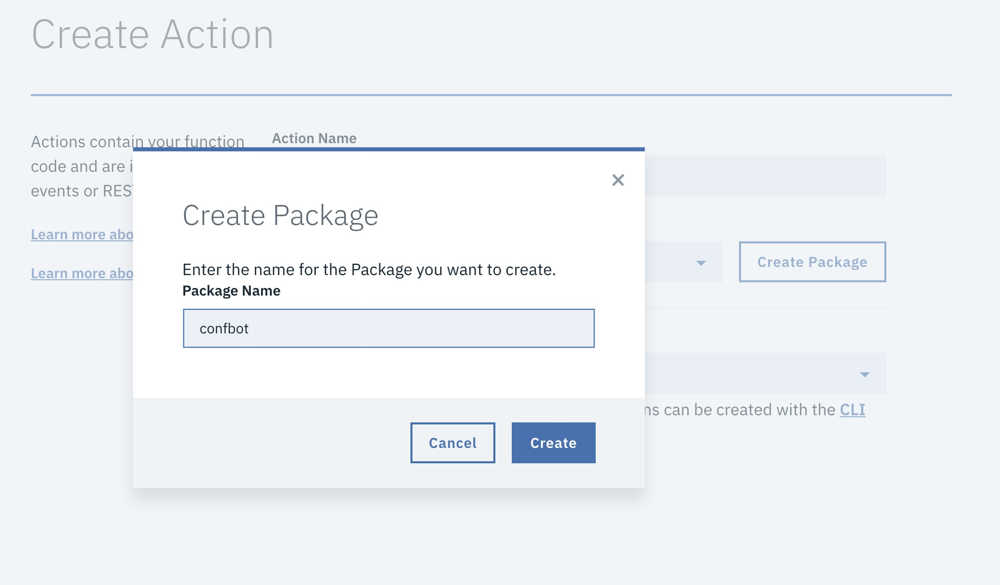

8. Click on `Create` to go into the new action.

    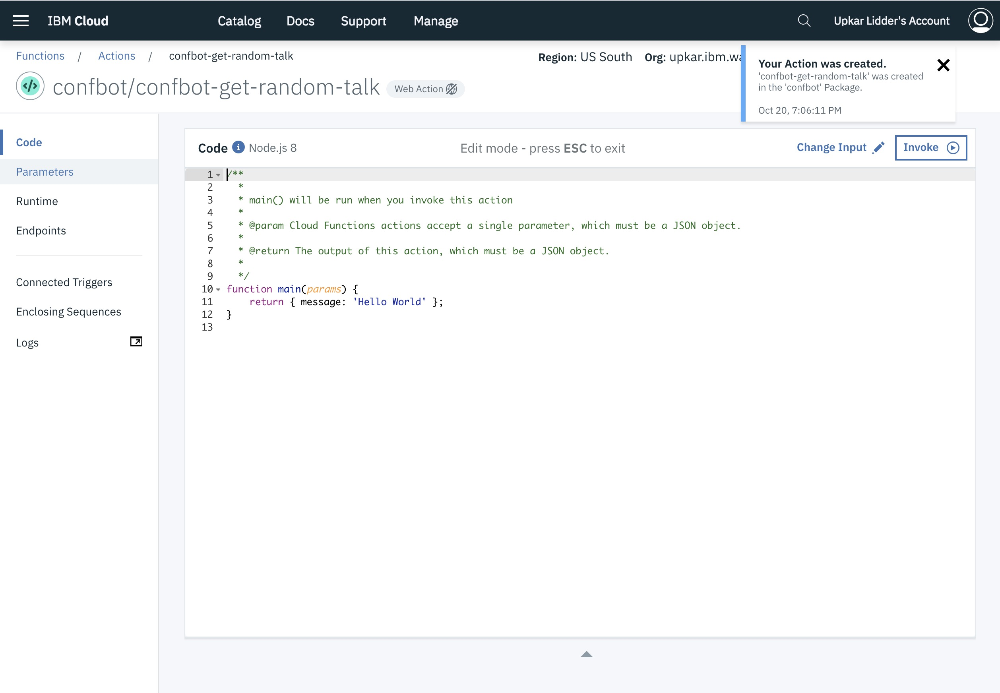

9. Click on `Parameters` to add the cloudant username and password to the action. You can get your username, and password from the `cloudant/.env.json` file you created in the previous section. Alternatively, you can go to your Dashboard and copy them from the `service credentials` tab.

    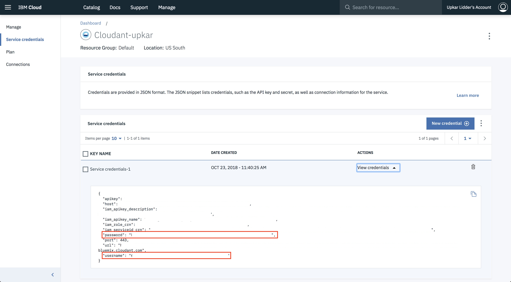

10. Add three values: user, password and database as shown below.

    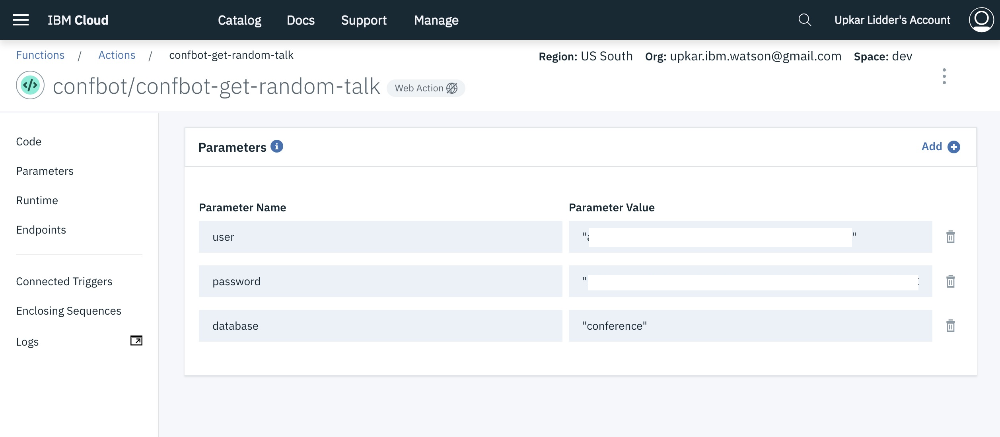

11. Click on `code` and add the contents of the file `ibm-function/confbot-get-random-talk.js` to the action.

    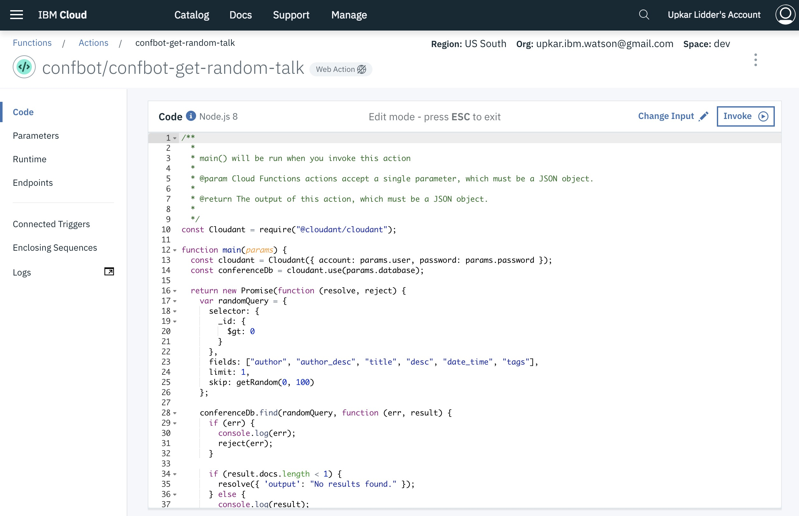

12. Click on `invoke` to run the function. You should see an author in the console.

    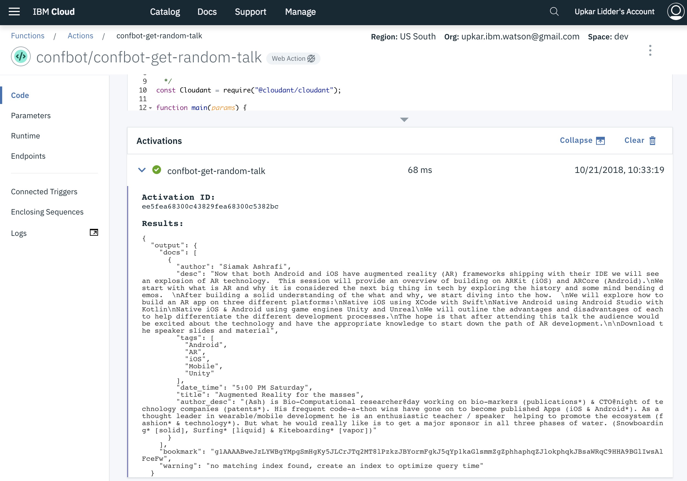

### [Go back to main page](README.md)
