# Import conference bot into Watson Assistant

## Create Watson Assistant service

1. Sign into [IBM Cloud](https://console.bluemix.net).

    

2. Click on `Catalog` and enter `waston assistant` in the search field. Select the `Watson Assistant (previously Conversation)` service by IBM.
  
    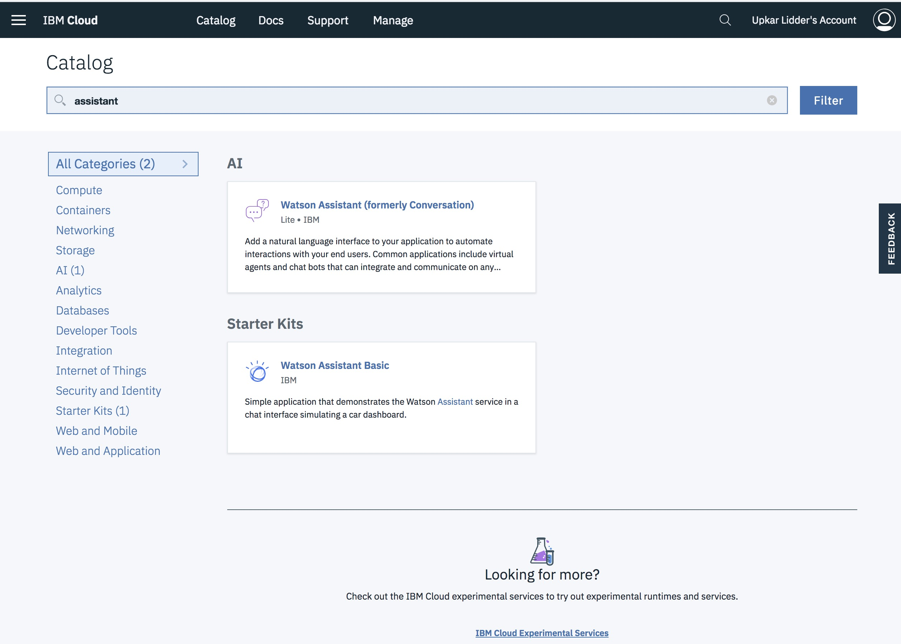

3. Enter a meaninngful name and click on `Create`. Ensure that `US South` is the selected region.

    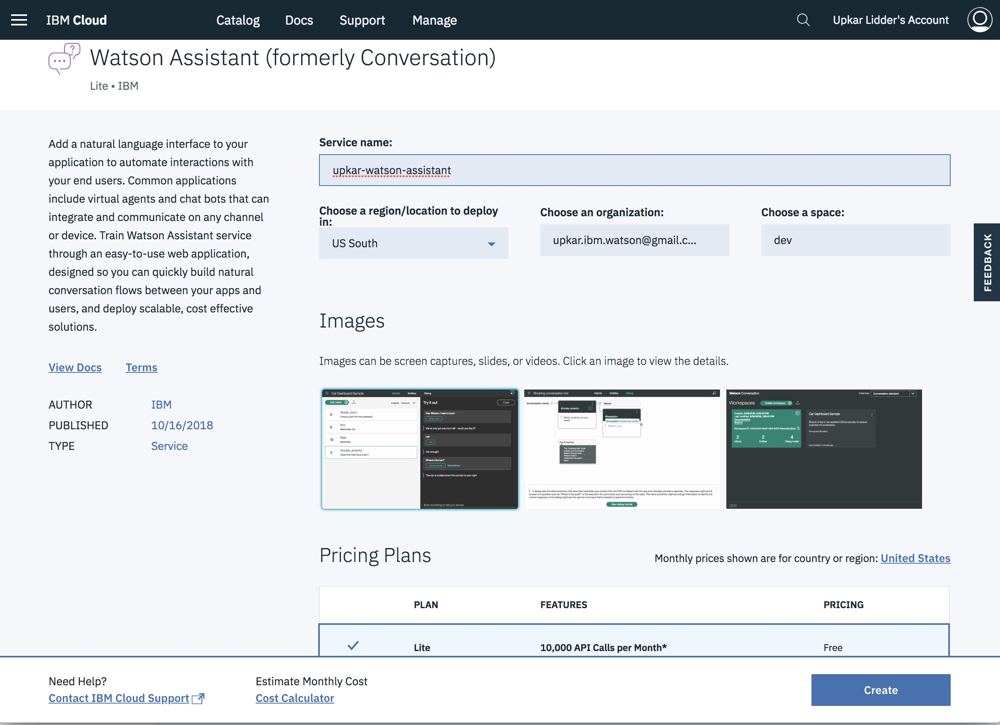

4. Once the service is provisioned, `Launch` the took

    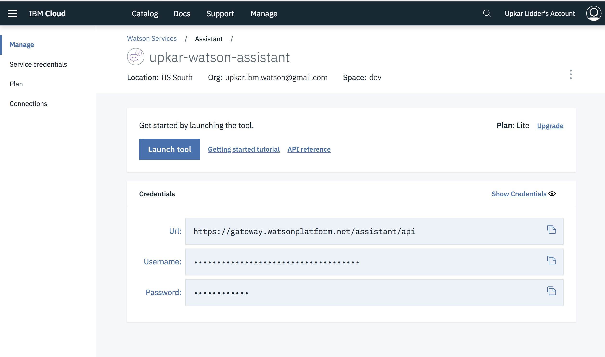

5. You will be taken to the home page for Watson Assistant.

    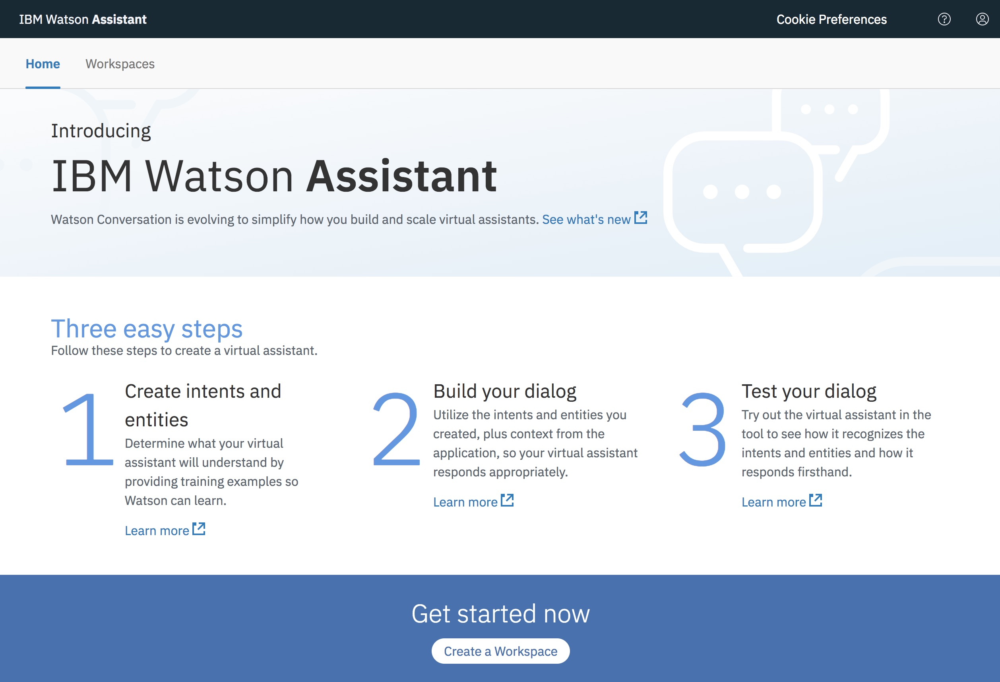
## Import the sample conference bot into Watson Assistant

6. Click on `Workspaces` tab and then the `import` icon.

    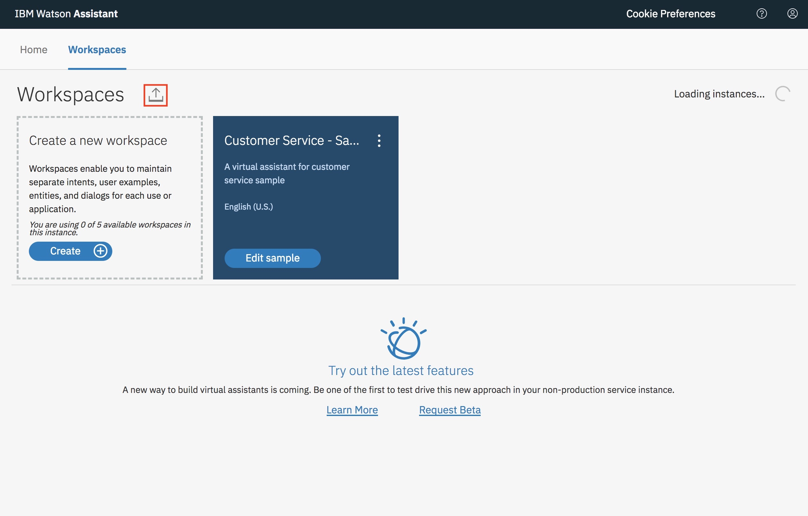

7. Import the json file from `watson-assistant/confbot.json` into the workspace.

    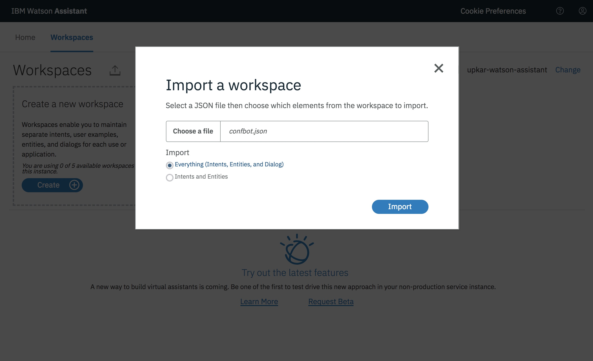

8. Once the file is imported, you will be taken to the workspace.

    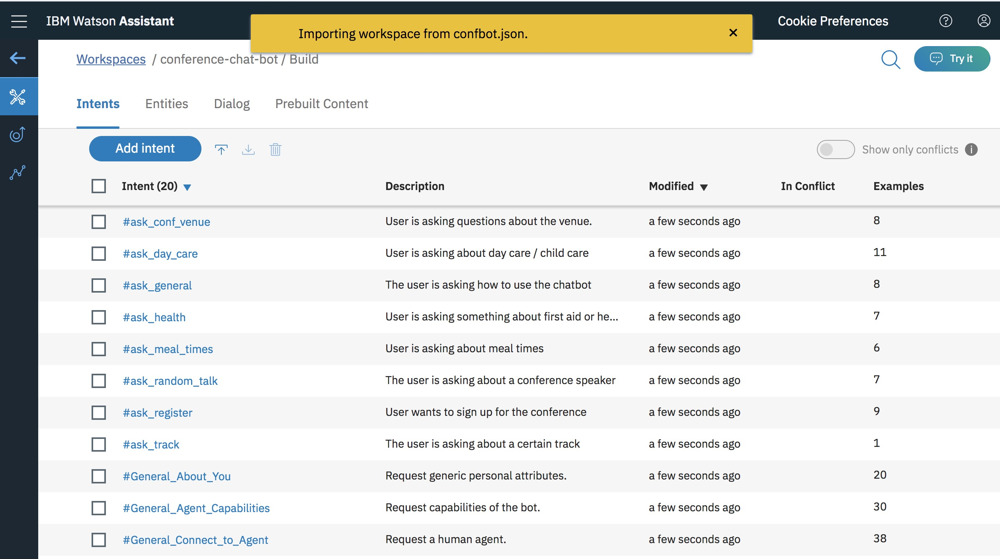

9. Go the `Dialog` node.

    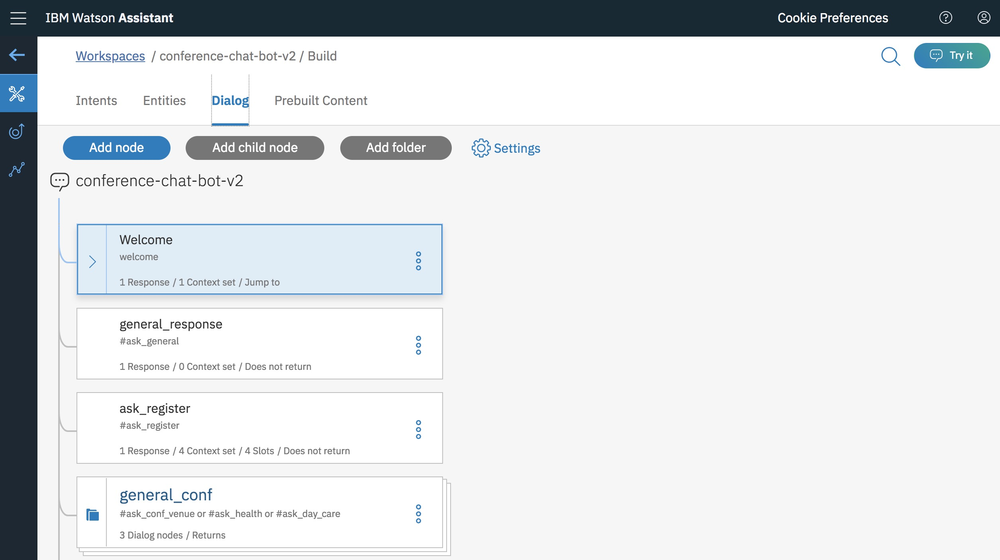

## Get IBM Function credentials

10. We need the IBM Cloud API key before we can proceed. Go to [IBM API Key page](https://console.bluemix.net/openwhisk/learn/api-key).

    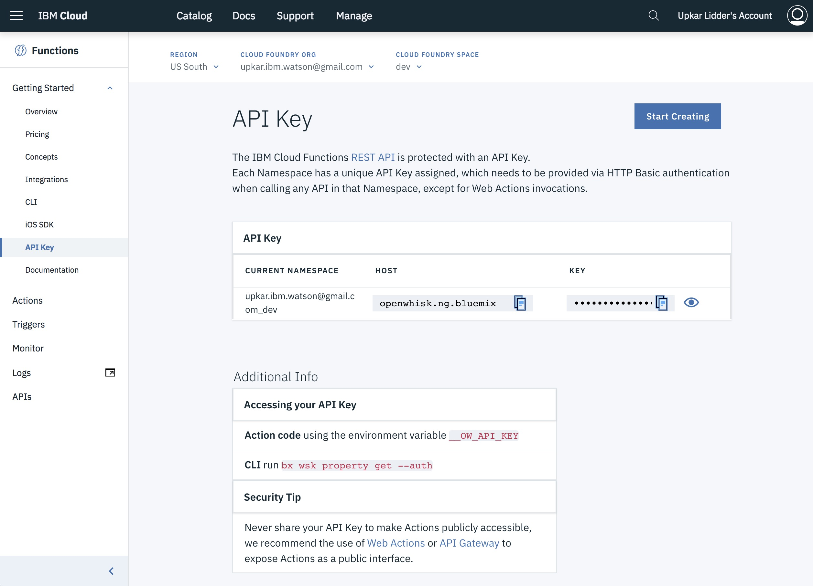

11. Click the Show Auth Key icon to show the credentials. The segment before the colon `:` is your user ID. The segment after the colon is your password.

    **To protect the credentials, do not store them in the Watson Assistant workspace. Instead, pass them from the client application as part of context. We are making an exception with this demo as we don't have a client application.**

12. Click on the `Welcome` node. Enter your credentials in the following form in the `context variables` section.

    `{"user":"","password":""}`

    Your screen should look something like this:

    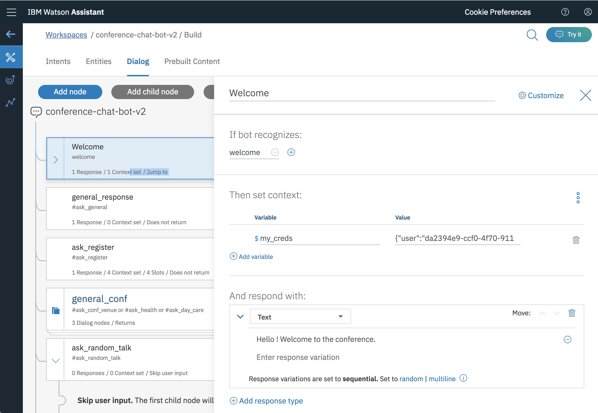

## Change the IBM Function URLs to your own Functions
13. Open the `ask_random_talk` node.

    

14. We need to replace the `"name"` attribute with your own unique URL for the `confbot-get-random-talk` IBM Function. To do so, open [IBM Functions](https://console.bluemix.net/openwhisk/actions).

    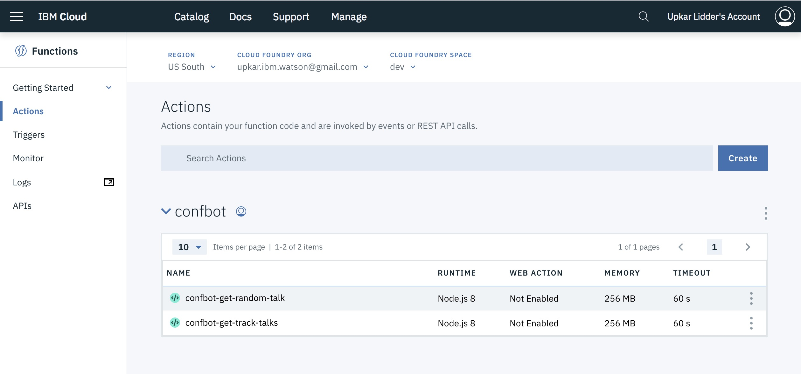

15. Open the `confbot-get-random-talk` function. and click on `Endpoints`.

    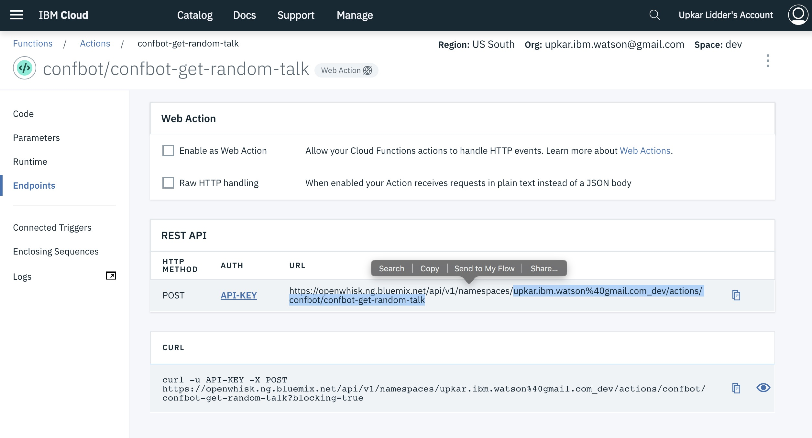

16. Copy everthing after `namespaces` in the REST API URL. If there is a URL escaped character, replace it with the unicode value.

    `upkar.ibm.watson%40gmail.com_dev/actions/confbot/confbot-get-random-talk`

    changes to 

    `upkar.ibm.watson@gmail.com_dev/actions/confbot/confbot-get-random-talk`

    Copy this URL in the json editor.
    
    

17. Repeat the above steps for `ask_track` node.

    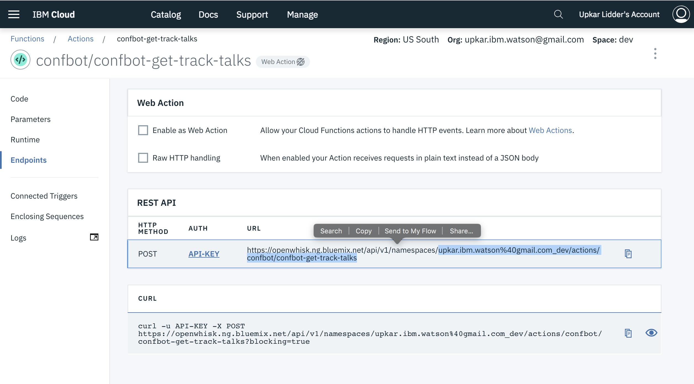

    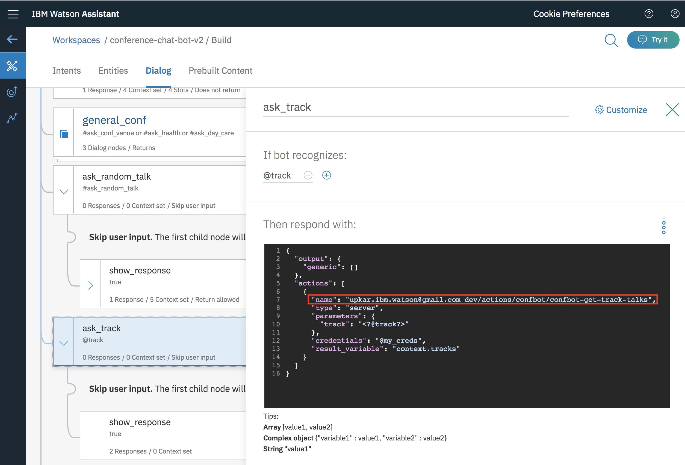

## Try it out !

18. Try your chatbot in the `try it` panel. If you have any questions or run into issues, please ask me at @lidderupk or open a pull request.

### [Go back to main page](README.md)

